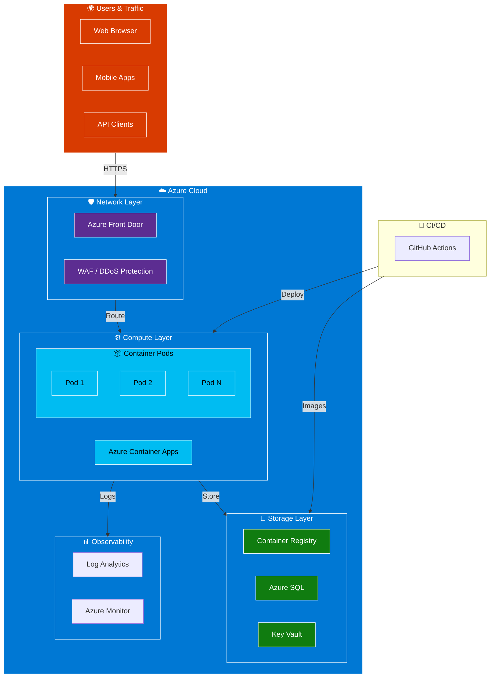
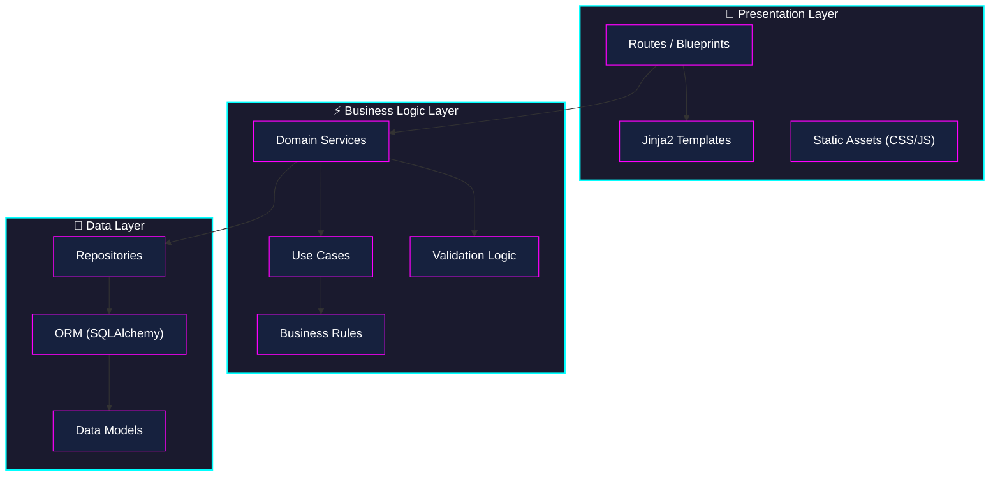
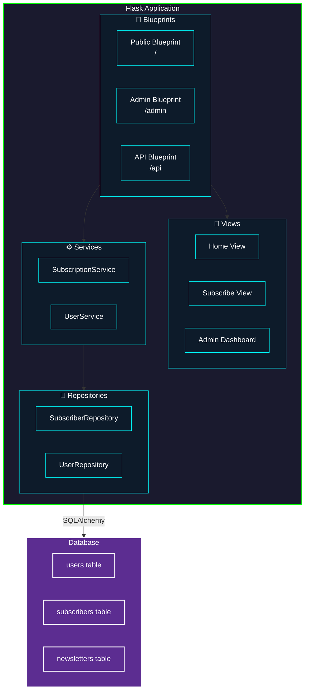

<div class="neon-page-header">
  <h1 class="neon-heading">🏗️ SYSTEM ARCHITECTURE</h1>
</div>

## High-Level Overview



---

## Application Architecture

### Clean Architecture Layers



---

## Component Diagram



---

## Data Flow

### 1. Subscription Flow

```
1. User submits form → POST /subscribe/confirm
                      │
                      ▼
2. Request Validation (public.py:20-23)
                      │
                      ▼
3. SubscriptionService.subscribe() (subscription_service.py:20-31)
                      │
          ┌───────────┴───────────┐
          ▼                       ▼
   Validation: Email     Normalization:
   Pattern check          lowercase, trim
          │                       │
          └───────────┬───────────┘
                      ▼
4. SubscriberRepository.save() (subscriber_repository.py:14-16)
                      │
                      ▼
5. Render thank_you.html with subscriber data
```

---

## Configuration

### Environment-Based Config

| Environment | Config Class | Debug | Purpose |
|-------------|--------------|-------|---------|
| Development | `DevelopmentConfig` | `True` | Local development |
| Testing | `Config` | `False` | Unit testing |
| Production | `ProductionConfig` | `False` | Live deployment |

### Configuration Properties

```python
@dataclass
class Config:
    SECRET_KEY: str           # Session encryption key
    DEBUG: bool              # Debug mode toggle
    TESTING: bool            # Testing mode toggle
    DATABASE_URL: str        # Database connection
    AZURE_CLIENT_ID: str     # Azure AD client
    AZURE_TENANT_ID: str     # Azure AD tenant
```

---

## Security Architecture

```
┌─────────────────────────────────────────────────────────────────┐
│                      SECURITY LAYERS                             │
├─────────────────────────────────────────────────────────────────┤
│  1. NETWORK                                                    │
│     - Azure Front Door (WAF, DDoS protection)                   │
│     - Private endpoints for ACR                                 │
│     - NSG rules restricting access                              │
├─────────────────────────────────────────────────────────────────┤
│  2. APPLICATION                                                 │
│     - HTTPS enforced everywhere                                 │
│     - CORS configuration                                         │
│     - Rate limiting on public endpoints                         │
├─────────────────────────────────────────────────────────────────┤
│  3. DATA                                                        │
│     - Encrypted at rest (Azure storage)                        │
│     - TLS 1.3 for data in transit                              │
│     - PII masking in logs                                       │
├─────────────────────────────────────────────────────────────────┤
│  4. IDENTITY                                                    │
│     - Azure AD authentication                                   │
│     - RBAC for admin access                                     │
│     - Service principal for CI/CD                               │
└─────────────────────────────────────────────────────────────────┘
```

---

## Scalability Design

### Horizontal Scaling

```
                    ┌─────────────────┐
                    │   Load Balancer │
                    └────────┬────────┘
                             │
          ┌──────────────────┼──────────────────┐
          │                  │                  │
          ▼                  ▼                  ▼
    ┌──────────┐      ┌──────────┐      ┌──────────┐
    │  Pod 1   │      │  Pod 2   │      │  Pod N   │
    │ Flask    │      │ Flask    │      │ Flask    │
    │ 512MB    │      │ 512MB    │      │ 512MB    │
    └──────────┘      └──────────┘      └──────────┘
```

### Scaling Rules

| Metric | Threshold | Action |
|--------|-----------|--------|
| CPU | >70% | Scale up to max replicas |
| Memory | >80% | Scale up to max replicas |
| Request count | >1000/min | Scale up |
| Queue depth | >100 | Scale workers |

---

## Related Documentation

- [Visitor Journey](../visitor-journey.md) | User experience flow & conversion funnel
- [API Reference](api.md)
- [Data Models](data-models.md)
- [Deployment Guide](../deployment/azure.md)
- [Development Setup](../development/setup.md)

---

[← Overview](overview.md) | [Next: API Reference →](api.md)

<style>
.neon-page-header {
  background: linear-gradient(90deg, #0a0a0a 0%, #1a1a2e 50%, #0a0a0a 100%);
  padding: 2rem;
  border-radius: 8px;
  margin-bottom: 2rem;
  border: 1px solid #00ffff33;
}

.neon-heading {
  font-family: 'Courier New', monospace;
  font-size: 2rem;
  color: #fff;
  text-shadow:
    0 0 10px #00ffff,
    0 0 20px #00ffff;
  margin: 0;
}
</style>
