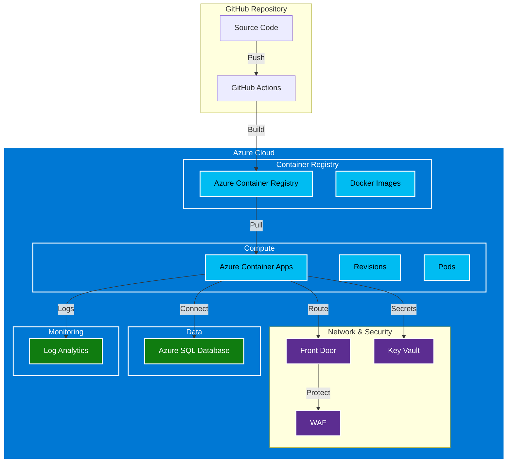

<div class="neon-page-header">
  <h1 class="neon-heading">☁️ AZURE DEPLOYMENT</h1>
</div>

## Deployment Architecture



---

## Azure Resources

| Resource | Purpose | Pricing Tier |
|----------|---------|--------------|
| Azure Container Registry | Docker image storage | Basic |
| Azure Container Apps | Application hosting | Consumption |
| Azure Front Door | Load balancing | Standard |
| Log Analytics | Monitoring | Pay-as-you-go |
| Key Vault | Secrets management | Standard |

---

## Prerequisites

### Required Azure CLI Version

```bash
az --version
# azure-cli                         2.50.0
```

### Required Permissions

| Role | Scope | Purpose |
|------|-------|---------|
| Contributor | Resource Group | Deploy resources |
| AcrPush | ACR | Push images |
| Owner | Subscription | Create resources |

---

## Initial Deployment

### Step 1: Login to Azure

```bash
# Interactive login
az login

# Or with service principal
az login --service-principal \
  --username $AZURE_CLIENT_ID \
  --password $AZURE_CLIENT_SECRET \
  --tenant $AZURE_TENANT_ID
```

### Step 2: Create Resource Group

```bash
# Create resource group
az group create \
  --name hello-cicd-rg \
  --location eastus

# Verify creation
az group show --name hello-cicd-rg
```

### Step 3: Create Azure Container Registry

```bash
# Create ACR
az acr create \
  --resource-group hello-cicd-rg \
  --name helloCicdRegistry \
  --sku Basic \
  --admin-enabled true

# Login to ACR
az acr login --name helloCicdRegistry
```

### Step 4: Create Container Apps Environment

```bash
# Create Log Analytics workspace
az monitor log-analytics workspace create \
  --resource-group hello-cicd-rg \
  --workspace-name hello-cicd-logs

# Get Log Analytics key
LOG_ANALYTICS_KEY=$(az monitor log-analytics workspace get-shared-keys \
  --resource-group hello-cicd-rg \
  --workspace-name hello-cicd-logs \
  --query primaryKey -o tsv)

# Create Container Apps environment
az containerapp env create \
  --resource-group hello-cicd-rg \
  --name hello-cicd-env \
  --location eastus \
  --logs-workspace-id $LOG_ANALYTICS_KEY \
  --logs-workspace-key $LOG_ANALYTICS_KEY
```

### Step 5: Deploy Container App

```bash
# Deploy container app
az containerapp create \
  --resource-group hello-cicd-rg \
  --name hello-cicd-app \
  --environment hello-cicd-env \
  --image helloCicdRegistry.azurecr.io/hello-cicd:latest \
  --target-port 5000 \
  --ingress external \
  --min-replicas 1 \
  --max-replicas 10 \
  --cpu 0.5 \
  --memory 1Gi \
  --env-vars "FLASK_ENV=production"
```

---

## CI/CD Pipeline

### GitHub Actions Workflow

```yaml
# .github/workflows/deploy.yml
name: Build and Deploy

on:
  push:
    branches: [main]

jobs:
  build-and-deploy:
    runs-on: ubuntu-latest
    steps:
      - uses: actions/checkout@v4

      - uses: azure/login@v2
        with:
          client-id: ${{ vars.AZURE_CLIENT_ID }}
          tenant-id: ${{ vars.AZURE_TENANT_ID }}
          subscription-id: ${{ vars.AZURE_SUBSCRIPTION_ID }}

      - name: Build and push to ACR
        run: |
          az acr build \
            --registry ${{ vars.ACR_NAME }} \
            --image hello-cicd:${{ github.sha }} .

      - name: Deploy to Container Apps
        run: |
          az containerapp update \
            --name ${{ vars.CONTAINER_APP }} \
            --resource-group ${{ vars.RESOURCE_GROUP }} \
            --image $ACR_SERVER/hello-cicd:${{ github.sha }}
```

### Required GitHub Secrets

| Secret | Description |
|--------|-------------|
| `AZURE_CLIENT_ID` | Service principal client ID |
| `AZURE_CLIENT_SECRET` | Service principal secret |
| `AZURE_TENANT_ID` | Azure AD tenant ID |
| `AZURE_SUBSCRIPTION_ID` | Azure subscription ID |
| `ACR_NAME` | Container registry name |
| `CONTAINER_APP` | Container app name |
| `RESOURCE_GROUP` | Resource group name |

### Required GitHub Variables

| Variable | Description |
|----------|-------------|
| `ACR_NAME` | Registry name (without .azurecr.io) |
| `RESOURCE_GROUP` | Resource group name |
| `CONTAINER_APP` | Container app name |

---

## Deployment Commands

### Manual Deployment

```bash
# Build and push image
az acr build \
  --registry helloCicdRegistry \
  --image hello-cicd:latest \
  --file Dockerfile .

# Update container app
az containerapp update \
  --name hello-cicd-app \
  --resource-group hello-cicd-rg \
  --image helloCicdRegistry.azurecr.io/hello-cicd:latest
```

### Rollback Deployment

```bash
# List previous revisions
az containerapp revision list \
  --name hello-cicd-app \
  --resource-group hello-cicd-rg \
  --output table

# Set traffic to previous revision
az containerapp ingress traffic set \
  --name hello-cicd-app \
  --resource-group hello-cicd-rg \
  --revision-weight latest=0 previous-revision=100
```

---

## Scaling Configuration

```bash
# Update scaling rules
az containerapp update \
  --name hello-cicd-app \
  --resource-group hello-cicd-rg \
  --min-replicas 2 \
  --max-replicas 20 \
  --cpu 0.75 \
  --memory 1.5Gi
```

### Auto-Scaling

```yaml
# KEDA scaling rules
scale:
  rules:
    - name: http-scale
      http:
        metadata:
          concurrentRequests: "100"
    - name: cpu-scale
      custom:
        metadata:
          type: cpu
          value: "70"
```

---

## Monitoring

### View Logs

```bash
# Stream application logs
az containerapp logs \
  --name hello-cicd-app \
  --resource-group hello-cicd-rg \
  --follow

# View last 100 lines
az containerapp logs \
  --name hello-cicd-app \
  --resource-group hello-cicd-rg \
  --lines 100
```

### View Metrics

```bash
# View CPU and memory metrics
az monitor metrics list \
  --resource $CONTAINER_APP_ID \
  --metric CPUUsage,MemoryUsage \
  --output table
```

---

## Troubleshooting

### Check Deployment Status

```bash
# Show container app details
az containerapp show \
  --name hello-cicd-app \
  --resource-group hello-cicd-rg

# Check revision status
az containerapp revision show \
  --name hello-cicd-app--rev-1 \
  --resource-group hello-cicd-rg
```

### Restart Application

```bash
# Restart container app
az containerapp restart \
  --name hello-cicd-app \
  --resource-group hello-cicd-rg
```

---

## Related Documentation

- [Development Setup](../development/setup.md)
- [Architecture Overview](../architecture/overview.md)
- [CI/CD Pipeline](cicd.md)
- [Monitoring Guide](monitoring.md)

---

[← Deployment Home](README.md) | [Next: CI/CD Pipeline →](cicd.md)

<style>
.neon-page-header {
  background: linear-gradient(90deg, #0a0a0a 0%, #1a2e47 50%, #0a0a0a 100%);
  padding: 2rem;
  border-radius: 8px;
  margin-bottom: 2rem;
  border: 1px solid #0088ff33;
}

.neon-heading {
  font-family: 'Courier New', monospace;
  font-size: 2rem;
  color: #fff;
  text-shadow:
    0 0 10px #0088ff,
    0 0 20px #0088ff;
  margin: 0;
}
</style>
