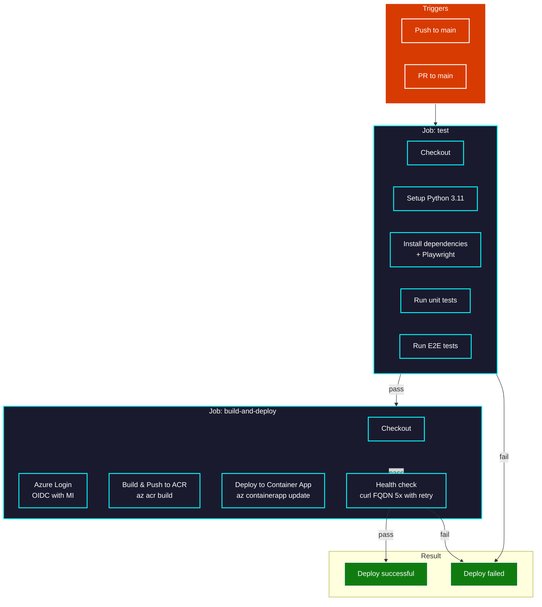

<div class="neon-page-header">
  <h1 class="neon-heading">CI/CD PIPELINE</h1>
</div>

## Pipeline Overview



---

## Pipeline Details

### Job: test
| Step | Description |
|------|-------------|
| Checkout | `actions/checkout@v4` |
| Setup Python | `actions/setup-python@v5` with Python 3.11 |
| Install Deps | `pip install -r requirements.txt` + Playwright |
| Run Unit Tests | `pytest tests/unit tests/integration -v` |
| Run E2E Tests | Flask dev server + `pytest tests/e2e -v` |

### Job: build-and-deploy
| Step | Description |
|------|-------------|
| Checkout | `actions/checkout@v4` |
| Azure Login | `azure/login@v2` with OIDC (MI) |
| Build & Push ACR | `az acr build` to `acrhellocicda593ac50` |
| Deploy ACA | `az containerapp update` with env vars |
| Health Check | `curl` FQDN 5 times with 10s retry |

---

## Environment Variables

| Variable | Source | Value |
|----------|--------|-------|
| `DB_TYPE` | Variable | `mssql` |
| `DB_SERVER` | Secret | `deplojdb.database.windows.net` |
| `DB_NAME` | Secret | `deplojdb1` |
| `DB_USERNAME` | Secret | `deplojadmin` |
| `DB_PASSWORD` | Secret | `grupp234!` |

---

## Pipeline Triggers

| Event | Branch | Action |
|-------|--------|--------|
| Push | main | Full deploy (test + build + deploy) |
| Pull Request | main | Build only (test job) |

---

## GitHub Variables

| Variable | Value |
|----------|-------|
| `ACR_NAME` | `acrhellocicda593ac50` |
| `CONTAINER_APP` | `ca-hello-cicd` |
| `RESOURCE_GROUP` | `rg-hello-cicd` |
| `AZURE_CLIENT_ID` | `d0d0a844-8bb6-4af4-9a74-5eed50645c23` |
| `AZURE_SUBSCRIPTION_ID` | `b03dac20-afc7-4b5e-9f20-8c25ea53289a` |
| `AZURE_TENANT_ID` | `16180687-01dd-4277-b954-505497a9a08f` |

---

## Permissions

```yaml
permissions:
  id-token: write   # Required for Azure OIDC login
  contents: read    # Required for checkout
```

---

[Azure Deployment](azure.md) | [Next: Monitoring](monitoring.md)

<style>
.neon-page-header {
  background: linear-gradient(90deg, #0a0a0a 0%, #1a2e47 50%, #0a0a0a 100%);
  padding: 2rem;
  border-radius: 8px;
  margin-bottom: 2rem;
  border: 1px solid #0088ff33;
}

.neon-heading {
  font-family: 'Courier New', monospace;
  font-size: 2rem;
  color: #fff;
  text-shadow: 0 0 10px #0088ff, 0 0 20px #0088ff;
  margin: 0;
}
</style>
