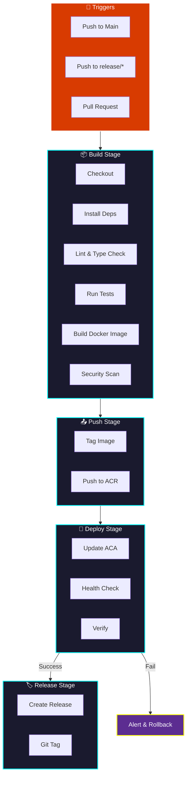

  <h1 class="neon-heading">🔄 CI/CD PIPELINE</h1>

## Pipeline Flow

## Pipeline Triggers

| Event | Branch | Action |
|-------|--------|--------|
| Push | main | Full deploy |
| Push | release/* | Stage deploy |
| Pull Request | any | Build only |
| Tag | v*.*.* | Release deploy |

---

[← Azure Deployment](azure.md) | [Next: Monitoring →](monitoring.md)

