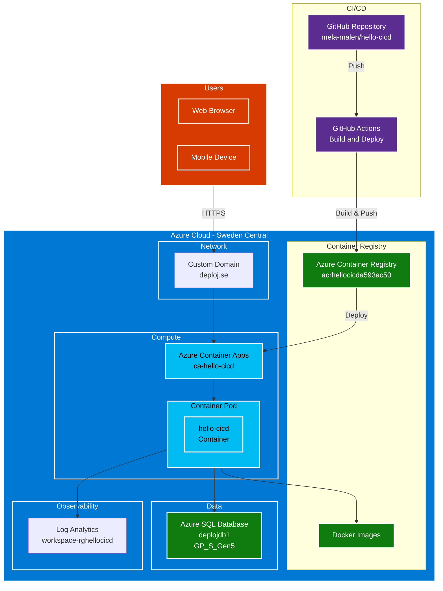
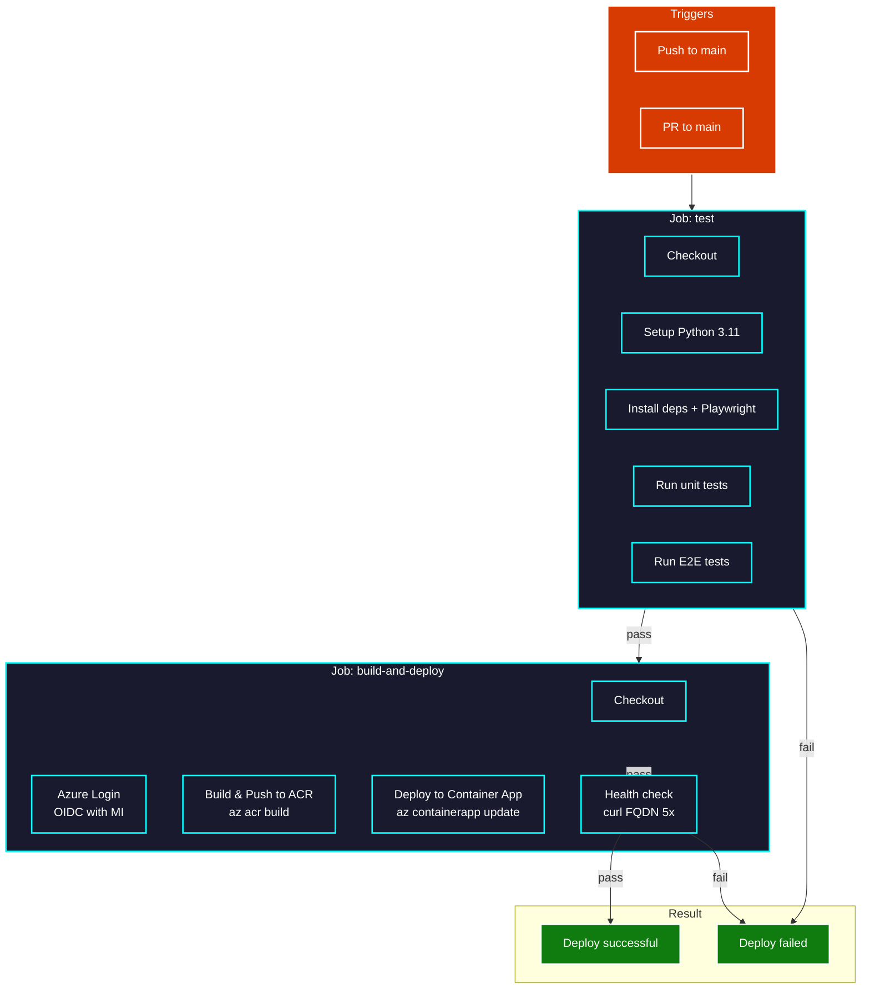
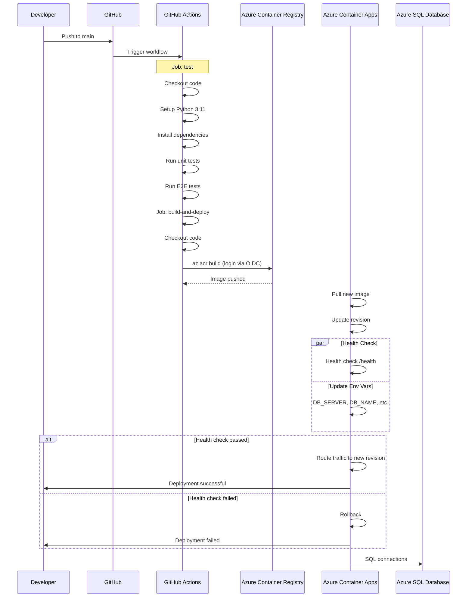
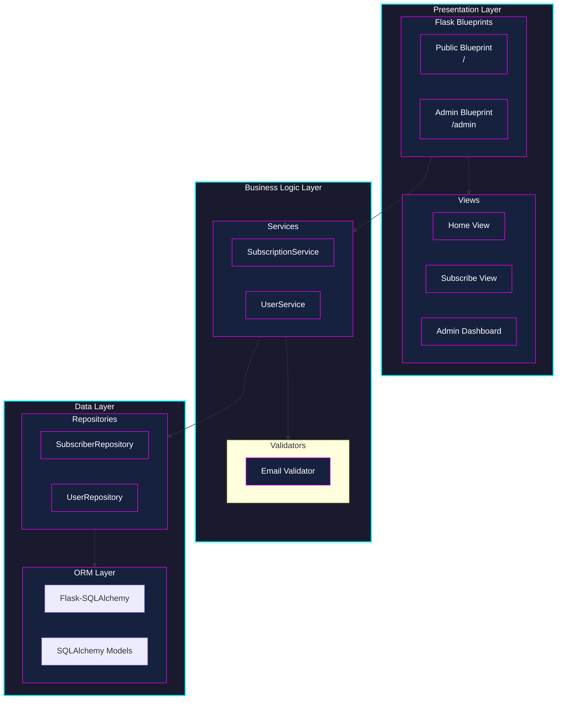
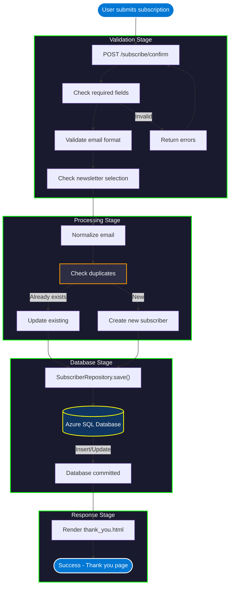
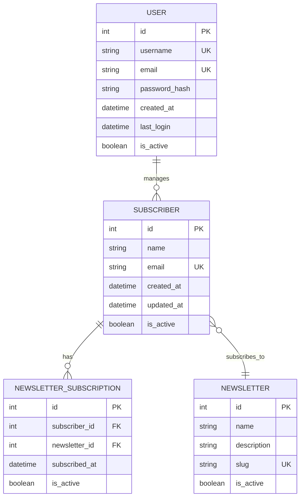
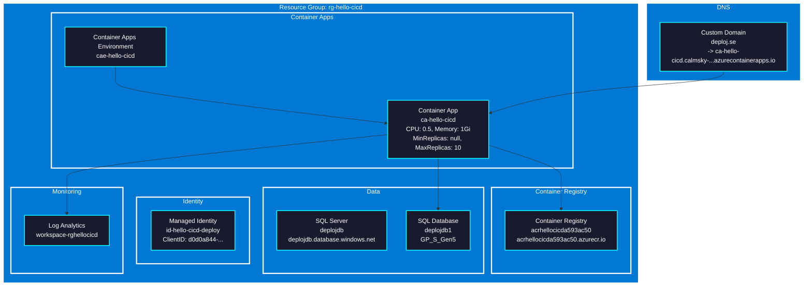
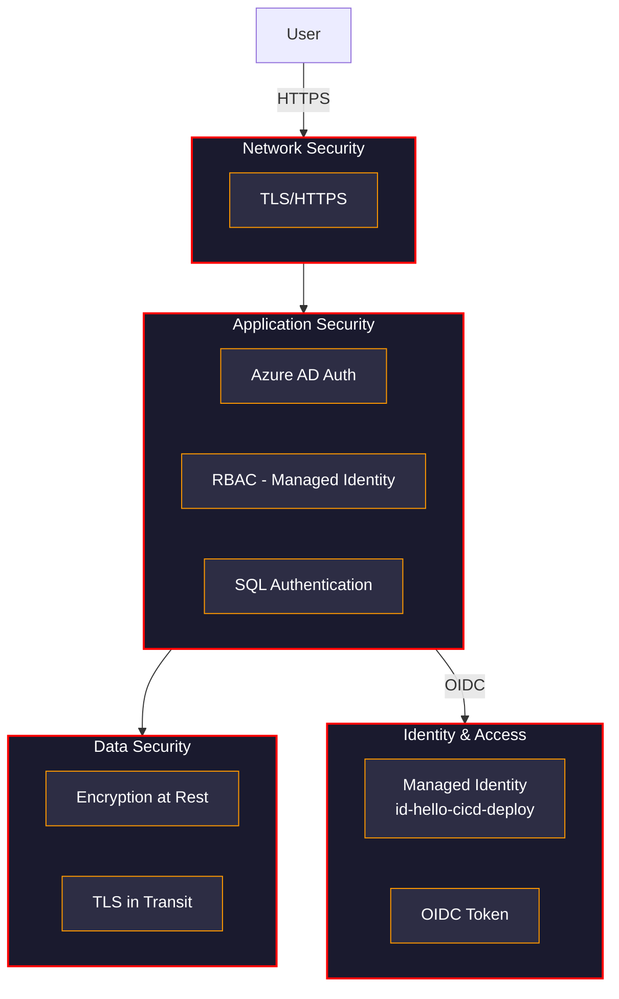

  <h1 class="neon-heading">DIAGRAMS</h1>

## System Architecture

---

## CI/CD Pipeline Flow

---

## Deployment Sequence

---

## Application Component Architecture

---

## Data Flow: Subscription Process

---

## Database Schema

---

## Infrastructure Resources

---

## Security Architecture

---

## Project Structure

```mermaid
flowchart TD
    root["hello-cicd/"]

    root --> README["README.md"]
    root --> Docker["Dockerfile"]
    root --> dockerignore[".dockerignore"]
    root --> reqs["requirements.txt"]
    root --> wsgi["wsgi.py"]
    root --> pytest["pytest.ini"]
    root --> gitignore[".gitignore"]

    root --> app["app/"]
    app --> init["__init__.py"]
    app --> routes["routes/"]
    routes --> public["public.py"]
    routes --> admin["admin.py"]
    app --> models["models.py"]
    app --> services["services/"]
    services --> sub["subscription_service.py"]
    services --> user["user_service.py"]
    app --> config["config.py"]

    root --> tests["tests/"]
    tests --> unit["unit/"]
    unit --> test_regression["test_regression.py"]
    unit --> test_sub_repo["test_subscriber_repository.py"]
    unit --> test_sub_svc["test_subscription_service.py"]
    tests --> integration["integration/"]
    integration --> test_routes["test_routes.py"]
    tests --> e2e["e2e/"]
    e2e --> test_visitor["test_visitor_journey.py"]
    e2e --> test_admin["test_admin_journey.py"]

    root --> github[".github/"]
    github --> workflows["workflows/"]
    workflows --> deploy["deploy.yml"]

    root --> docs["docs/"]
    docs --> overview["overview.md"]
    docs --> diagrams["diagrams.md"]
    docs --> visitor["visitor-journey.md"]
    docs --> architecture["architecture/"]
    docs --> deployment["deployment/"]
    docs --> development["development/"]
    docs --> guides["guides/"]

    classDef folder fill:#0078d4,stroke:#fff,stroke-width:2px,color:#fff
    classDef file fill:#1a1a2e,stroke:#00ff00,stroke-width:1px,color:#fff

    class root folder
    class docs,app,github,tests,routes,services,unit,integration,e2e,workflows,architecture,deployment,development,guides folder
    class README,Docker,dockerignore,reqs,wsgi,pytest,gitignore,init,public,admin,models,sub,user,config,test_regression,test_sub_repo,test_sub_svc,test_routes,test_visitor,test_admin,deploy,overview,diagrams,visitor file
```

---

[Back to Home](README.md)

