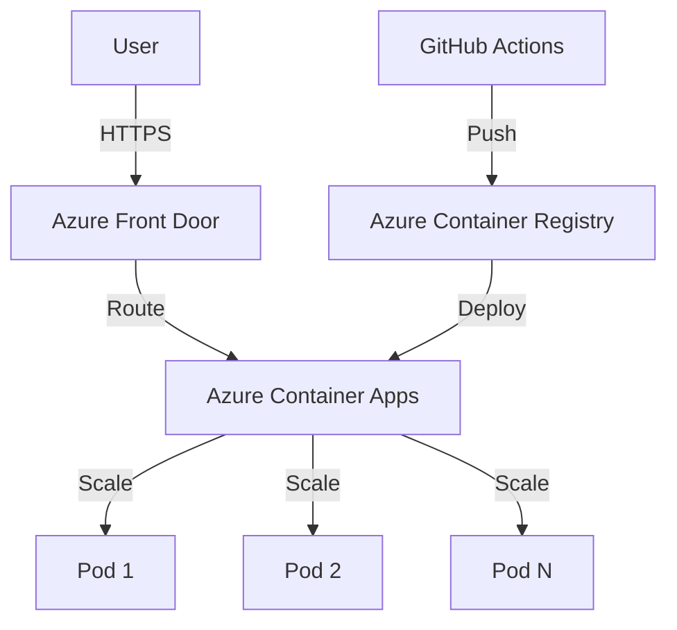
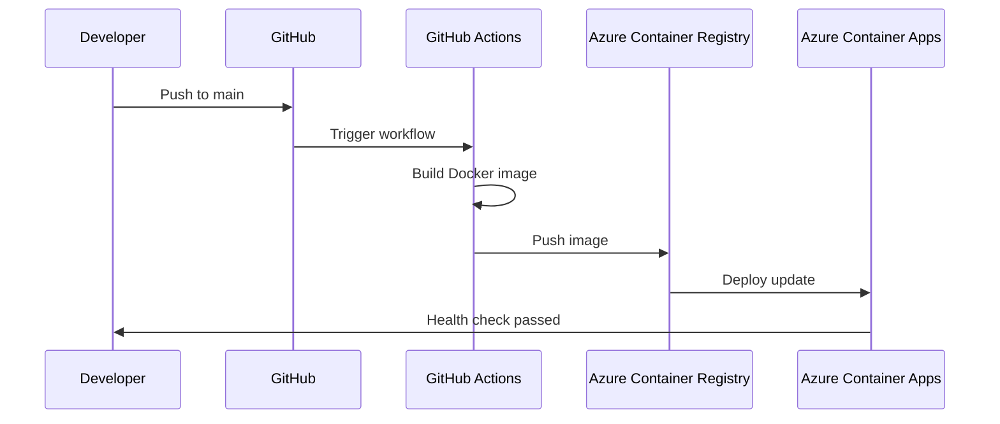

<div class="neon-page-header">
  <h1 class="neon-heading">📊 DIAGRAMS</h1>
</div>

## Architecture Diagram (Mermaid)



## CI/CD Flow



## Project Structure

```
hello-cicd/
├── README.md              ← Entry Point
├── docs/
│   ├── overview.md       ← Project Overview
│   ├── architecture.md    ← Architecture Index
│   │   ├── overview.md   ← System Architecture
│   │   ├── api.md        ← API Reference
│   │   └── data-models.md← Data Models
│   ├── development.md    ← Development Index
│   │   ├── setup.md      ← Platform Setup
│   │   ├── workflow.md   ← Dev Workflow
│   │   ├── testing.md    ← Testing Guide
│   │   └── style-guide.md← Code Style
│   ├── deployment.md     ← Deployment Index
│   │   ├── azure.md      ← Azure Deployment
│   │   ├── cicd.md       ← CI/CD Pipeline
│   │   └── monitoring.md ← Monitoring Guide
│   └── guides.md         ← Guides Index
│       ├── contributing.md← Contributing
│       ├── docker.md     ← Docker Guide
│       └── troubleshooting.md← Troubleshooting
```

---

[← Back to Home](README.md)

<style>
.neon-page-header {
  background: linear-gradient(90deg, #0a0a0a 0%, #1a1a2e 50%, #0a0a0a 100%);
  padding: 2rem;
  border-radius: 8px;
  margin-bottom: 2rem;
  border: 1px solid #ff00ff33;
}

.neon-heading {
  font-family: 'Courier New', monospace;
  font-size: 2rem;
  color: #fff;
  text-shadow:
    0 0 10px #ff00ff,
    0 0 20px #ff00ff;
  margin: 0;
}
</style>
