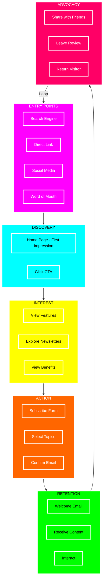
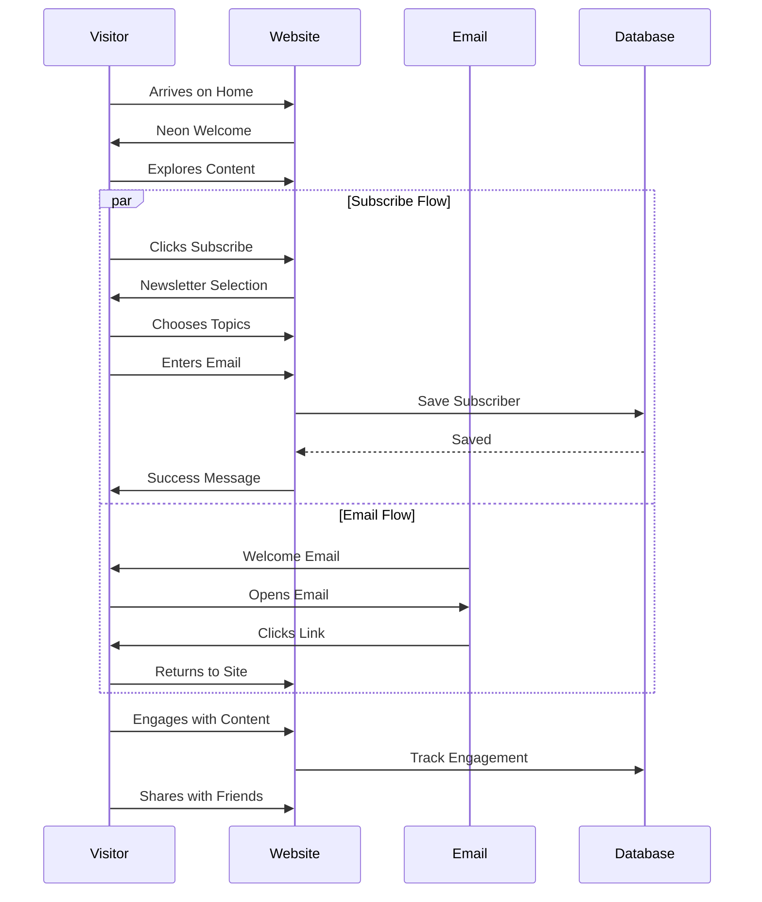
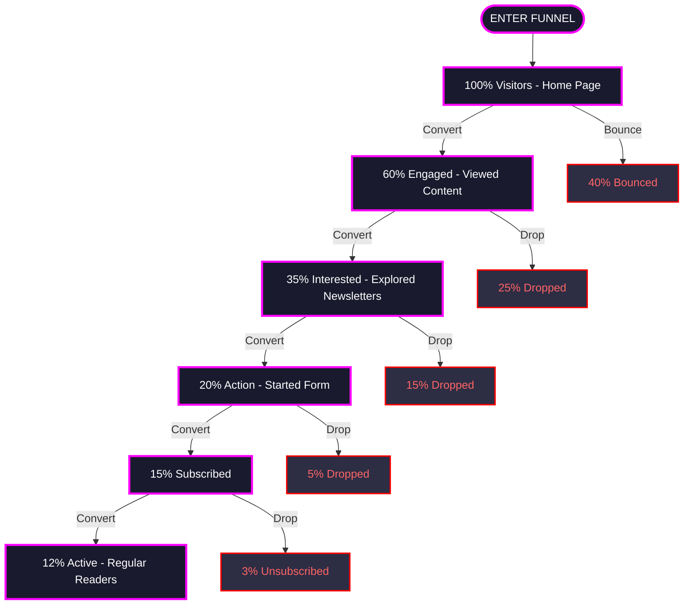
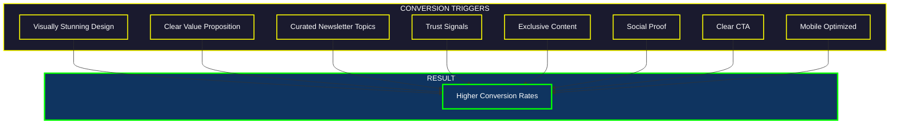
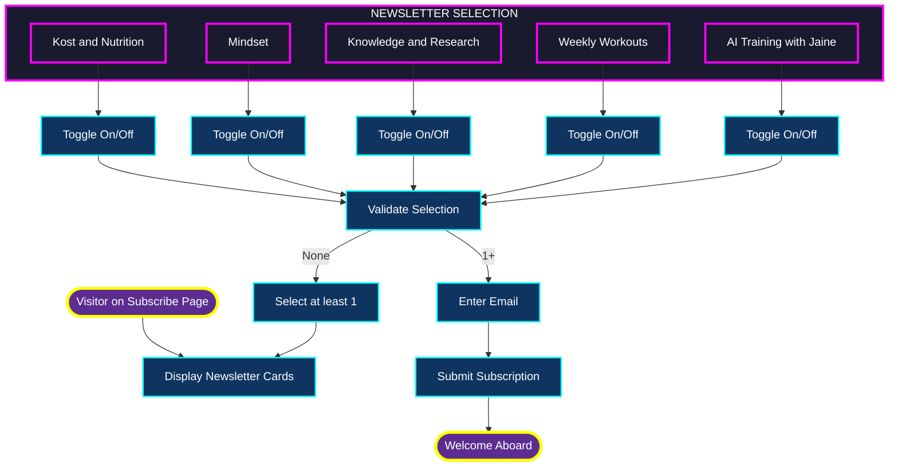
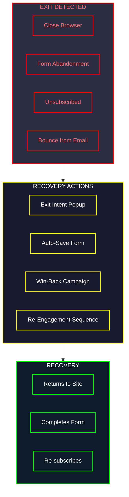
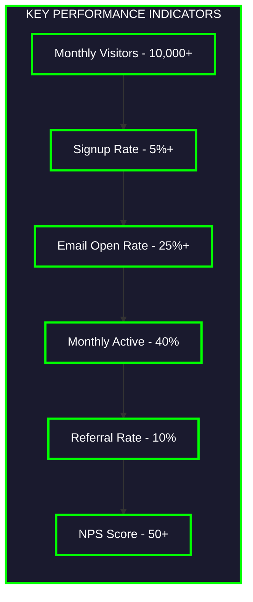

  <h1 class="neon-heading-retro">VISITOR JOURNEY</h1>
  
Experience the Neon Highway

## Complete Visitor Journey

---

## User Touchpoints Sequence

---

## Journey Map - 5 Stages

```mermaid
flowchart LR
    subgraph Stage1["STAGE 1: AWARENESS"]
        A1["Discover via Search"]
        A2["See Ad/Post"]
        A3["Social Share"]
    end

    subgraph Stage2["STAGE 2: CONSIDERATION"]
        B1["Visit Home"]
        B2["Read Content"]
        B3["Evaluate Options"]
    end

    subgraph Stage3["STAGE 3: CONVERSION"]
        C1["Fill Form"]
        C2["Confirm Email"]
        C3["Subscribe"]
    end

    subgraph Stage4["STAGE 4: RETENTION"]
        D1["Get Newsletter"]
        D2["Learn and Grow"]
        D3["Build Habit"]
    end

    subgraph Stage5["STAGE 5: ADVOCACY"]
        E1["Share Experience"]
        E2["Write Review"]
        E3["Refer Friends"]
    end

    A1 --> B1
    A2 --> B1
    A3 --> B1
    B1 --> B2
    B2 --> B3
    B3 --> C1
    C1 --> C2
    C2 --> C3
    C3 --> D1
    D1 --> D2
    D2 --> D3
    D3 --> E1
    E1 --> E2
    E2 --> E3

    classDef stage1 fill:#ff00ff,stroke:#fff,stroke-width:4px,color:#fff
    classDef stage2 fill:#00ffff,stroke:#fff,stroke-width:4px,color:#000
    classDef stage3 fill:#ffff00,stroke:#fff,stroke-width:4px,color:#000
    classDef stage4 fill:#00ff00,stroke:#fff,stroke-width:4px,color:#000
    classDef stage5 fill:#ff0066,stroke:#fff,stroke-width:4px,color:#fff

    class Stage1,A1,A2,A3 stage1
    class Stage2,B1,B2,B3 stage2
    class Stage3,C1,C2,C3 stage3
    class Stage4,D1,D2,D3 stage4
    class Stage5,E1,E2,E3 stage5
```

---

## Conversion Funnel

---

## Conversion Triggers

---

## Newsletter Selection Journey

---

## Exit Points and Recovery

---

## Success Metrics KPIs

---

[Back to Overview](architecture/overview.md) | [Next: API Reference](architecture/api.md)

